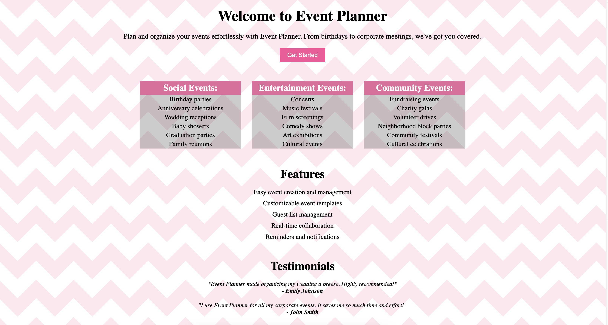
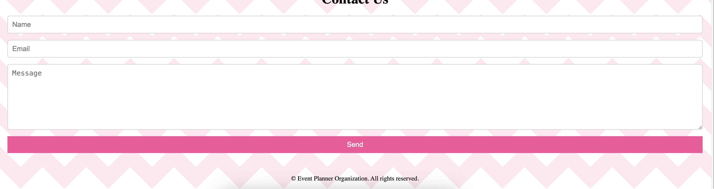

# coding-project-template
## Function Component Event Planner Landing Page

## Learning objectives
### After completing this lab, you will be able to:

1. Create a structured hierarchy of React components to organize the layout of the Event Planner landing page ensuring easy maintenance of issues

2. Write the user interface elements, such as headers, paragraphs, lists, and buttons, using JSX code

3. Use dynamic content rendering to show testimonials, event categories, and features that are dynamically fetched from data sources

4. Use semantic HTML markup to ensure usability and search engine optimization (SEO) benefits

## Prerequisites
1. Basic Knowledge of HTML
2. Intermediate knowledge of JavaScript
3. Basic Knowledge of React function component

